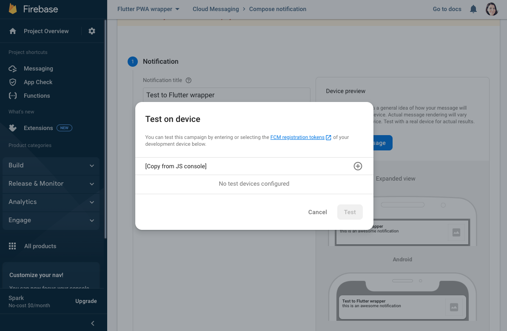

# Flutter PWA Wrapper

Wrapping your website in a native app with native push notifications and communication to the "inner" JavaScript!

## Setup 

1. Install [Flutter](https://docs.flutter.dev/get-started/install).
2. Go to `main.dart` and edit SETTINGS:

```
class SETTINGS {
  static const title = 'Flutter PWA Wrapper';
  static const url = 'https://bettysteger.com/flutter_pwa_wrapper/demo/'; 
}
```

### Set-up Push Notifications 

1. Create [Firebase](https://console.firebase.google.com/) App 

Register an iOS App, add your Apple bundle ID and download `GoogleService-Info.plist`. Open `ios/Runner.xcodeproj`. Move the `GoogleService-Info.plist` inside the `Runner` folder. You can ignore the next instructions in the Firebase setup wizard. Follow these [instructions](https://firebase.flutter.dev/docs/messaging/apple-integration) instead!


2. Debugging

Either do a `flutter run` in the console (will open iOS simulator if no device is connected) or **Run > Start Debugging** in VSCode (install [Flutter extension](https://docs.flutter.dev/get-started/editor?tab=vscode)).

Run the flutter app on your iOS device and click "Enable Notification" from the demo page. Copy the device token to the **Firebase Cloud Messaging > Compose notification > Send test message**:



### How to use in JavaScript

See [demo](https://github.com/bettysteger/flutter_pwa_wrapper/blob/main/docs/demo/index.html):

```
/**
 * This function is called by Flutter after `Notification.requestPermission` below is executed
 */
function setPushToken(token) { 
  // save token to current logged-in user in your DB 
} 

Notification.requestPermission()
```


## Development

### Run 

Either do a `flutter run` in the console (will open iOS simulator if no device is connected) or **Run > Start Debugging** in VSCode (install [Flutter extension](https://docs.flutter.dev/get-started/editor?tab=vscode)).

### Add a plugin

`flutter pub add firebase_core`

### Generate app icons & splash screen

See [flutter_launcher_icons](https://pub.dev/packages/flutter_launcher_icons)

`flutter pub run flutter_launcher_icons:main`

See [splash_screen_view](https://pub.dev/packages/splash_screen_view)

`flutter pub run splash_screen_view:create`

### Build ios

`flutter build ipa && open build/ios/archive/Runner.xcarchive`

### Build android

Signed with `/Applications/Android\ Studio.app/Contents/jre/jdk/Contents/Home/bin/keytool -genkey -v -keystore keys/keystore.jks -keyalg RSA -keysize 2048 -validity 10000 -alias FlutterApp`

`flutter build appbundle --release --no-tree-shake-icons && open build/app/outputs/bundle/release/`